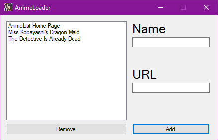
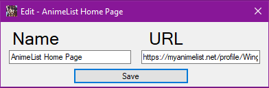

# Anime Manager
This program is a simple anime manager that was made to open multiple links at once through a shortcut.

This program features:
* Opens multiple links in your default browser.
* Simple GUI to edit the list of links.
* Ability to edit already saved links.

## How to use.
Clone the repo.

``git clone https://github.com/Wingwoo/AnimeManager``

Then build it using Visual Studio.

Once built, make two shortcuts to the exe, one with the argument "open". The shortcut without the argument will open the editor, and the shortcut with the argument will open all the links.

In the editor, double clicking any entry will open an editor to change its name and URL.

## Screenshots

